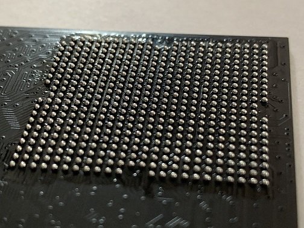
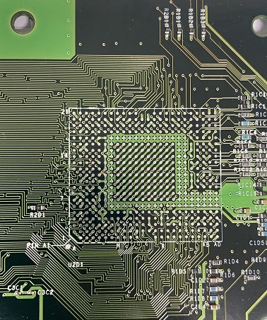
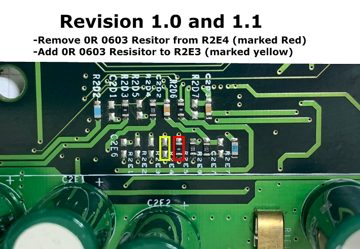
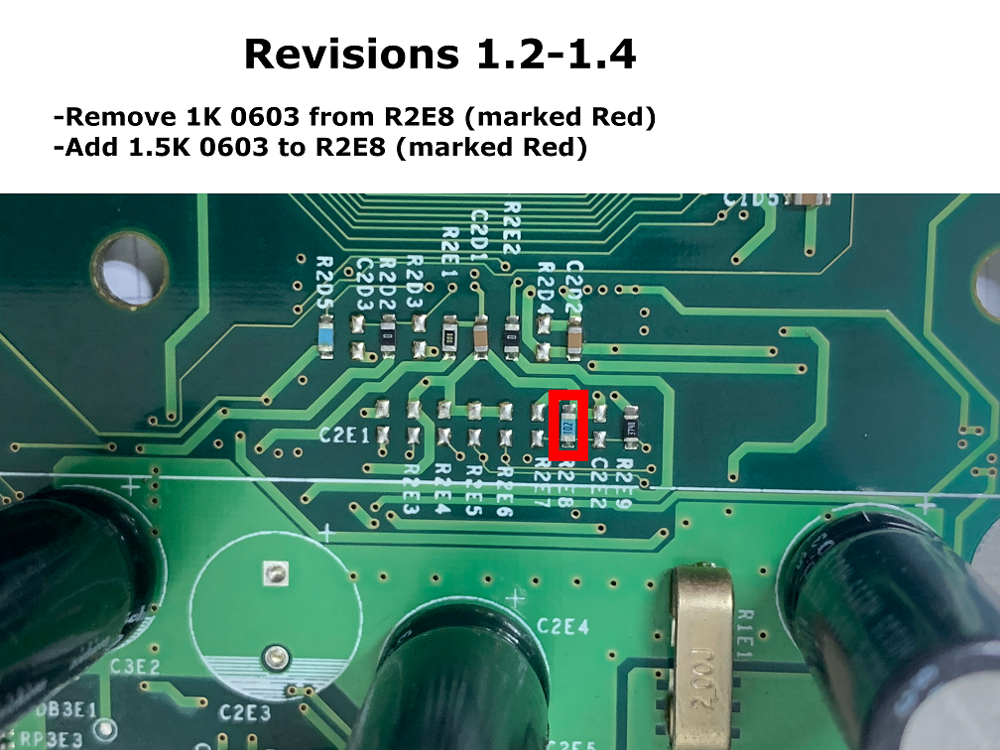
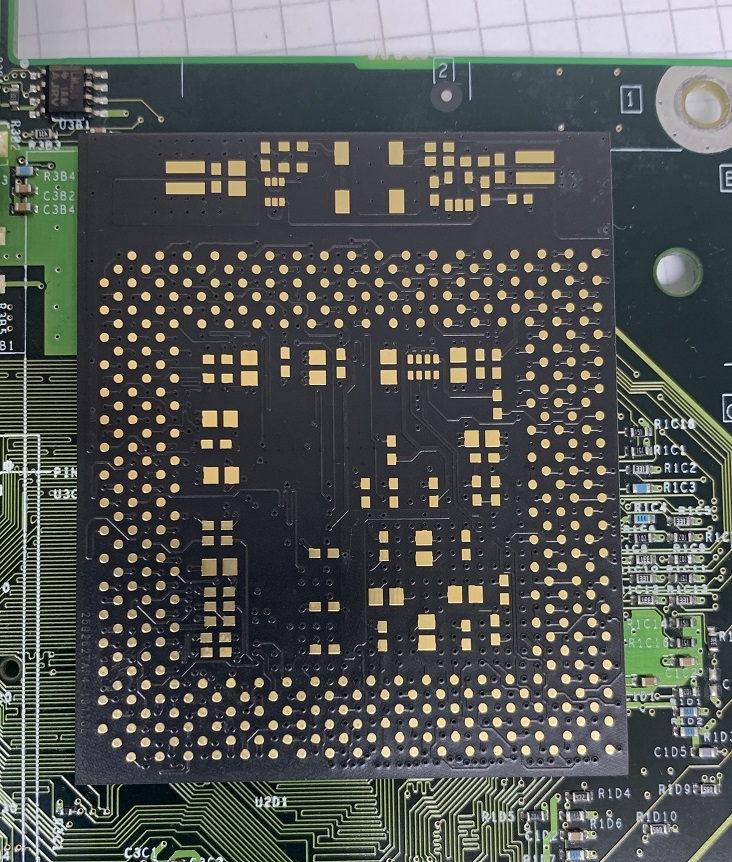
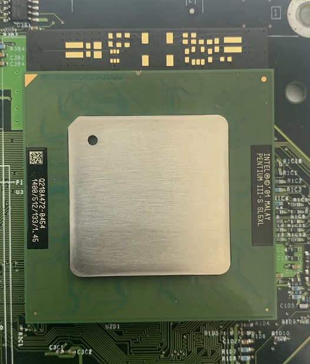
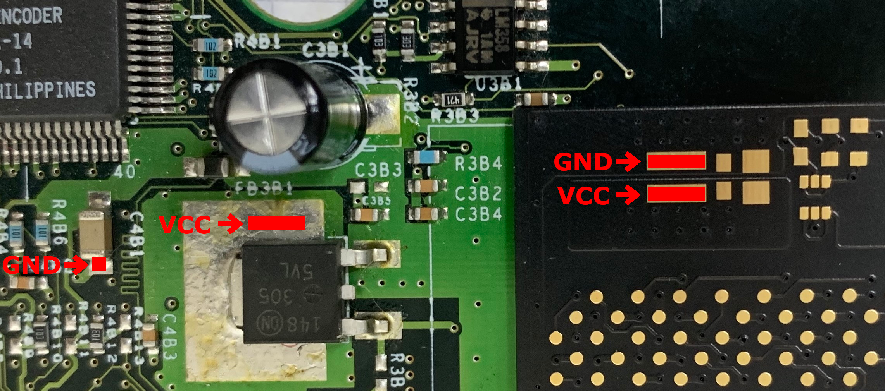

# Required Tools and parts
For the upgrade you should have good tools to suceed. Specially good soldering equipment and a steady hand!
You will need:
* BGA Rework station (alternatively a Hot-air Station and a preheater)
* Temperature controlled soldering iron
* A set of tweezers to install the smd components
* Solder paste and dispenser
* Solder wick to clean the board after removing the original CPU
* And of course flux!

## Choosing a processor
If you do the upgrade it is recommended to choose the 1400Mhz version of the processor.  
But because they get expensiver i recommend to use a 1000Mhz or 1200Mhz CPU to practice and continue with the expensiver CPU once you succeeded.  
  
Here's a list of tested CPUs:
| SSPEC Number | Clock speed | Cache |  
| --- | --- | --- |  
| SL5XL | 1400Mhz |  512Kb |  
| SL6BY | 1400Mhz |  512Kb |  
| SL5VX | 1333Mhz |  256Kb |  
| SL6BZ | 1333Mhz |  256Kb |  
| SL5LW | 1266Mhz |  512Kb |  
| SL5VX | 1200Mhz |  256Kb |  
| ... | ... | ... |  
  
Basically any Socket 370 Pentium 3 with 133Mhz FSB will work.  
The tualatin core CPUs are recommended as the heatspreader allows for easier heatsink attachment and they have 512kKB Level 2 Cache!

## SMD Components
You can buy the components from the vendor of your choice. 
NOTE: If you have a Rev1.2-1.4 you need to bu an extra 1.5Kohm 0603 resistor to set the CPU core voltage!  

| Reference | Qty | Description | Part Number | Manufacturer | Digikey part number |  
| --- | --- | --- | --- | --- | --- |  
| R6 | 1 | Res 0Ohm, 0603 | RC0603FR-070RL | Yageo | 311-0.0HRCT-ND |  
| RN1 | 1 | Res 1KOhm, 0603x4 |  |  |  |  
| R2, R8 | 2 | Res 1KOhm, 0603 | ESR03EZPJ102 | Rohm | RHM1.0KDCT-ND |  
| C5 | 1 | Cap 1nF, 0603 | C0603C102K4RECAUTO | Kemet | 399-17878-1-ND |  
| C45 | 1 | Cap 1uF, 0603 | CL10A105KA8NNNC | Samsung | 1276-1102-1-ND |  
| C14-C17,C19,C20,C23,C33,C34,C37,C38,C42 | 12 | Cap 4.7uF, 0805 | CL21A475KAQNNNE | Samsung | 1276-1244-1-ND |  
| C3,C4 | 2 | Cap 10pF, 0603 | 06035A100JAT2A | AVX | 478-1163-1-ND |  
| C7 | 1 | Cap 10uF, 0805 | CL21A106KOQNNNG | Samsung | 1276-6455-1-ND |  
| R5 | 1 | Res 15Ohm, 0603 | RNCP0603FTD15R0 | Stackpole | RNCP0603FTD15R0CT-ND |  
| R1 | 1 | Res 33Ohm, 0603 | CRGCQ0603J33R | TE | A130082CT-ND |  
| R7 | 1 | Res 100Ohm, 0603 | RT0603DRD07100RL | Yageo | 311-100DCT-ND  |  
| C1,C2,C6,C8-C13,C18,C21,C22,C24-C32,C35,C36,C39-C41,C43,C44,C46 | 29 | Cap 100nF, 0603 | CL10B104KB8NNNL | Samsung | 1276-CL10B104KB8NNNLCT-ND |  
| R3 | 1 | Res 330Ohm, 0603 | RC0603JR-07330RL | Yageo | 311-330GRCT-ND |  
| R4 | 1 | Res 470Ohm, 0603 | RC0603JR-07470RL | Yageo | 311-470GRCT-ND  |  
| D1 | 1 | LED Green, 0603 | LTST-C191KGKT | Lite-On | 160-1446-1-ND |  
| U2 | 1 | IC NC7SZ32, SOT23-5 | NC7SZ32M5X | ON-Semiconductor | NC7SZ32M5XCT-ND |  
| U1 | 1 | IC NC7WZ07, SC70 | NC7WZ07P6X | ON-Semiconductor | NC7WZ07P6XCT-ND |  
| OSC1 | 1 | OSC SG3030B | SG-3030JC 32.7680KB0: ROHS | Epson | SER4329CT-ND |  
| R2E8 | 1 | Res 1.5Kohm, 0603 |  RC0603FR-071K5L  | Yageo |  311-1.50KHRCT-ND  |  

 
## Starting the install
First thing to do is reball the CPU Adapter. You need The 0.76mm leaded solder balls, flux and the reball stecil.  
Not going into details how to reball such a pcb here. You should be able to find instructional videos for it on youtube.  
  

  

 

## Remove the original CPU
First thing to do on the motherboard is to fire up your bga rework station and remove the original CPU.  
Clean the remaining solder off the motherboard using solder wick and flux. After a cleanup you should have a nice and tidy looking board.
The result should look like this:  
  

  

 

## Setting the CPU core voltage
As the new CPU is running at a lower core voltage it has to be adjusted.  
---Don't forget about this step or you CPU might get damaged on the first startup!---  
Only a few changes have to be done to the resistors on the xbox console. Choose the correct image for the revision of your console.  
  

 

 

## Installing the Adapter
Next step is firing up your bga rework station again and solder in the CPU interposer board.  
Not much info here as you should know how to operate your rework station.  

 

## Installing the SMD components
With the Adapter soldered on it's time to install all the smd components from the BOM above.  
You can install all off them at once or just the parts that will be below the cpu once installed.  
That's up to you!

## Install the CPU
Now on to the most important step of soldering the CPU itself. Get your solder paste out and add a drop to every single of the 370 solder pad for the CPU.  
Then position the CPU on there and get back to your bga rework station and get it soldered down.  
  
Note: Once the CPU is installed you can test the motherboard!  
  
When done it should look like this:  

 

## Connecting power to the Adapter
The performance reduction circuit needs external power to work which has to be fed in externally.   Therefore 2 additional wires need to be attached to the cpu adapter.  
Connect the wires between the marked points and the system will be able to reduce the power to 50% of the maximum performance.  
  
Note: The system will NOT underclock the cpu.  
The cpu speed in XBMC will allways show the true clockspeed of 1400MHz!

 

## Common errors
If your system doesn’t boot up there is a problem with most likely either a component or your soldering.  
The most common error would be the FRAG which means flashing red and green.  
The system restarts 2 times and then flashes red and green.  
This error indicates a general hardware problem and as we just replaced the cpu you can take a guess which component it is.  
  
Reasons could be:  
-Defective CPU  
-Wrong cpu core voltage setting  
-Cold solder joint between adapter and motherboard or cpu and adapter  
  
Another error is the console flashing orange with the fans turned up to 100% instantly after power on.  
This error is a problem with either a defective cpu or a cold solder joint on the address or data lines of the cpu.  
To summarize it all one could say if it doesn’t boot up at the first try your chances are slim to get the console to work.  
The best you can do is inspect the solder points and rework any that look dodgy or are visually not connected.

